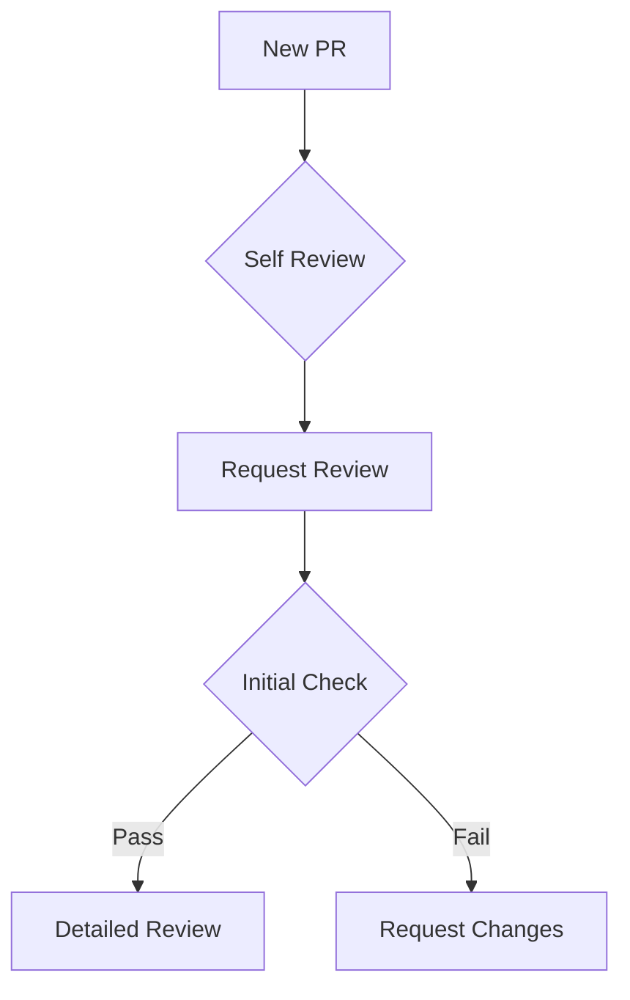

# Code Review Guidelines
*Created by: @balendra-cloud*  
*Last Updated: 2025-07-16 22:00:19 UTC*

## Table of Contents
- [General Guidelines](#general-guidelines)
- [Code Review Checklist](#code-review-checklist)
- [Review Process](#review-process)
- [Response Guidelines](#response-guidelines)
- [Best Practices](#best-practices)

## General Guidelines

### For Authors

#### Before Submitting
1. **Self-Review**
   - [ ] Review your own code first
   - [ ] Run all tests locally
   - [ ] Ensure CI/CD pipelines pass
   - [ ] Check code formatting
   - [ ] Verify documentation updates

#### PR Description
```markdown
## Changes
[Concise description of changes]

## Testing
- [ ] Unit Tests Added/Updated
- [ ] Integration Tests
- [ ] Manual Testing Steps

## Documentation
- [ ] API Documentation
- [ ] README Updates
- [ ] Comments Added

## Screenshots/Videos
[If applicable]

## Related Issues
Fixes #[issue_number]
```

### For Reviewers

#### Review Mindset
- Be constructive and respectful
- Focus on code, not the developer
- Consider context and constraints
- Share knowledge and alternatives
- Be explicit about required vs optional changes

## Code Review Checklist

### 1. Code Quality
- [ ] Follows project coding standards
- [ ] No duplicate code
- [ ] Appropriate error handling
- [ ] Proper logging implemented
- [ ] No hardcoded values
- [ ] Meaningful variable/method names

### 2. Architecture
- [ ] Follows SOLID principles
- [ ] Appropriate design patterns used
- [ ] Proper separation of concerns
- [ ] Scalable solution
- [ ] Maintainable structure

### 3. Security
- [ ] Input validation implemented
- [ ] Authentication/Authorization checked
- [ ] No sensitive data exposure
- [ ] SQL injection prevention
- [ ] XSS protection
- [ ] CSRF protection

### 4. Performance
- [ ] Efficient algorithms used
- [ ] No N+1 queries
- [ ] Proper indexing
- [ ] Caching strategy
- [ ] Resource optimization
- [ ] Memory management

### 5. Testing
- [ ] Unit tests added/updated
- [ ] Integration tests coverage
- [ ] Edge cases covered
- [ ] Mocking appropriate
- [ ] Test naming clear
- [ ] Test independence

### 6. Documentation
- [ ] Code comments clear
- [ ] API documentation updated
- [ ] README changes
- [ ] Release notes updated
- [ ] Configuration documented
- [ ] Dependencies documented

## Review Process

### 1. Initial Review


### 2. Review Stages

#### Stage 1: Quick Scan (30 mins max)
- Overall approach
- Major architectural issues
- Security concerns
- Basic functionality

#### Stage 2: Detailed Review (2 hours max)
- Code quality
- Test coverage
- Performance implications
- Documentation completeness

#### Stage 3: Final Verification
- Changes implemented
- CI/CD pipeline success
- Documentation updated
- Tests passing

## Response Guidelines

### Providing Feedback

#### Do's
```markdown
✅ "Consider using X pattern here because..."
✅ "This might be more efficient if..."
✅ "Great solution for handling X!"
✅ "Would you mind explaining the reasoning behind..."
```

#### Don'ts
```markdown
❌ "This is wrong"
❌ "Why did you do this?"
❌ "I wouldn't do it this way"
❌ "This needs to be changed"
```

### Comment Types

#### Required Changes
```markdown
[Required] Please add error handling for this edge case
Reason: System stability could be affected in production
```

#### Suggestions
```markdown
[Suggestion] Consider extracting this logic into a separate service
Benefit: Improved maintainability and reusability
```

#### Questions
```markdown
[Question] How does this handle concurrent requests?
Context: Understanding performance implications
```

#### Praise
```markdown
[Kudos] Excellent job on the optimization here!
Impact: Significant performance improvement
```

## Best Practices

### Time Management
- Review within 24 hours
- Spend maximum 2 hours per review
- Break large PRs into smaller reviews
- Use automated tools where possible

### Communication
- Be specific in feedback
- Provide context
- Include examples
- Use markdown formatting
- Link to documentation/resources

### Follow-up
- Acknowledge implemented changes
- Re-review promptly
- Track discussion resolutions
- Document decisions

## Tools and Automation

### Recommended Tools
```bash
# Code Formatting
prettier --write .
eslint .

# Static Analysis
sonarqube-scanner
security-checker

# Test Coverage
jest --coverage
```

### CI Checks
- Linting
- Unit Tests
- Integration Tests
- Security Scans
- Performance Tests
- Code Coverage

## Learning Resources
- [Google Engineering Practices](https://google.github.io/eng-practices/)
- [Conventional Comments](https://conventionalcomments.org/)
- [Code Review Best Practices](https://www.atlassian.com/agile/software-development/code-reviews)

---

## Review Size Guidelines

### Optimal PR Sizes
- 🟢 Small: < 200 lines
- 🟡 Medium: 200-500 lines
- 🔴 Large: > 500 lines (Consider splitting)

### Time Expectations
- Small PR: 1 hour
- Medium PR: 2 hours
- Large PR: Request splitting or schedule dedicated review session

---

*For questions or suggestions about these guidelines, please contact @balendra-cloud*

```

Would you like me to:
1. Add more specific examples for your programming language/framework?
2. Include templates for different types of changes (UI, API, Database, etc.)?
3. Add guidelines for specific review scenarios?
4. Include automated code review tool configurations?
5. Add more diagrams or flowcharts for the review process?