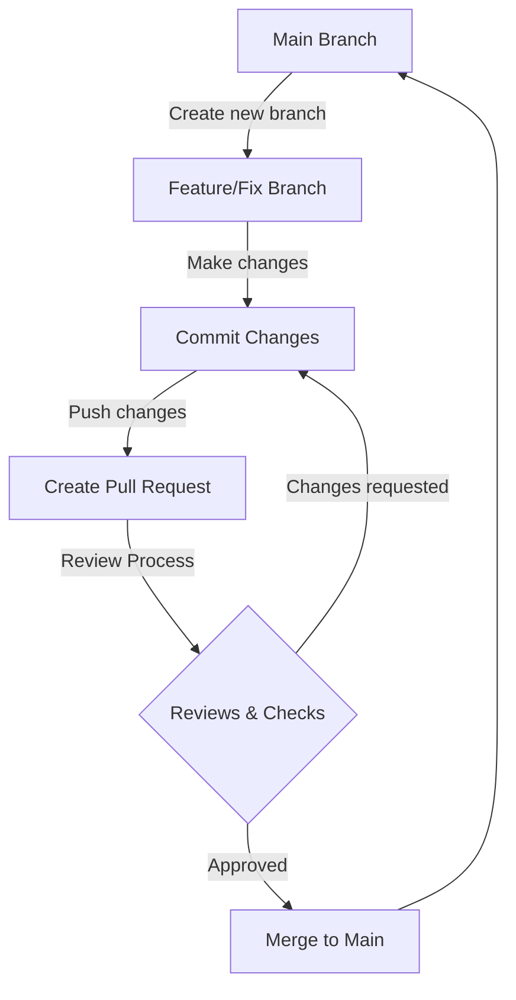
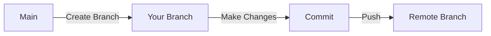
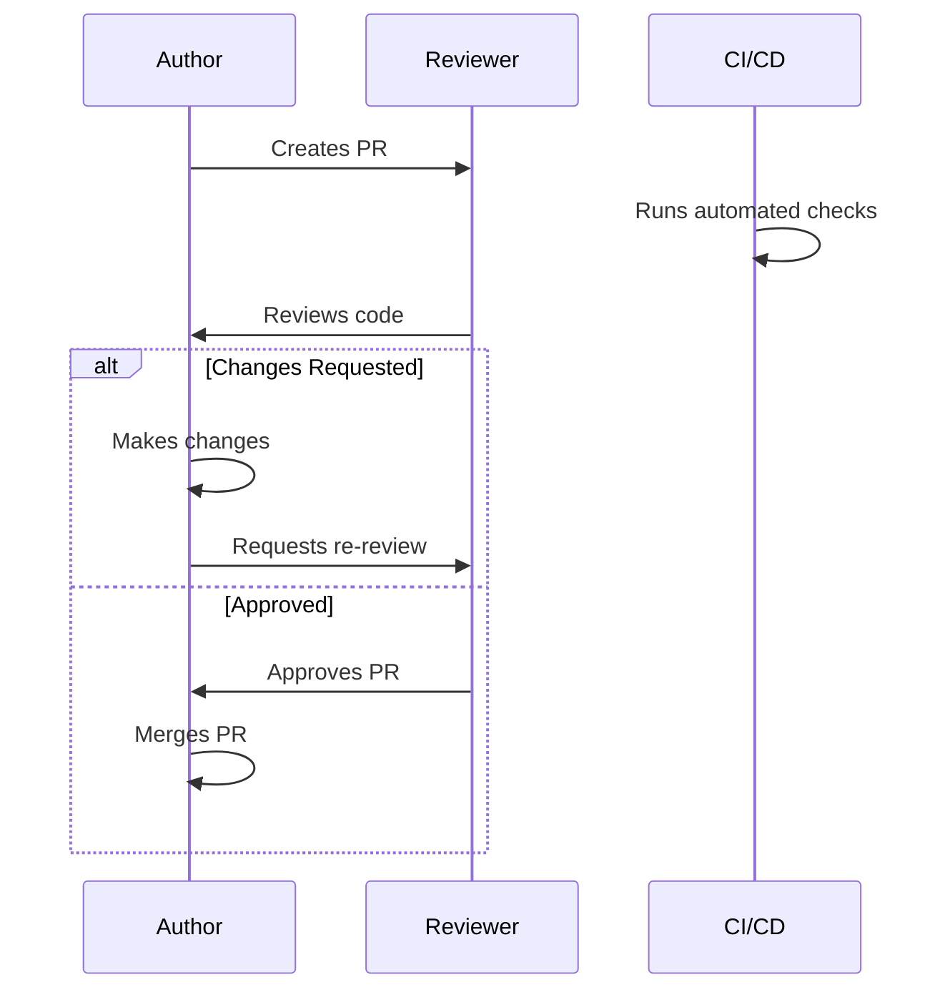
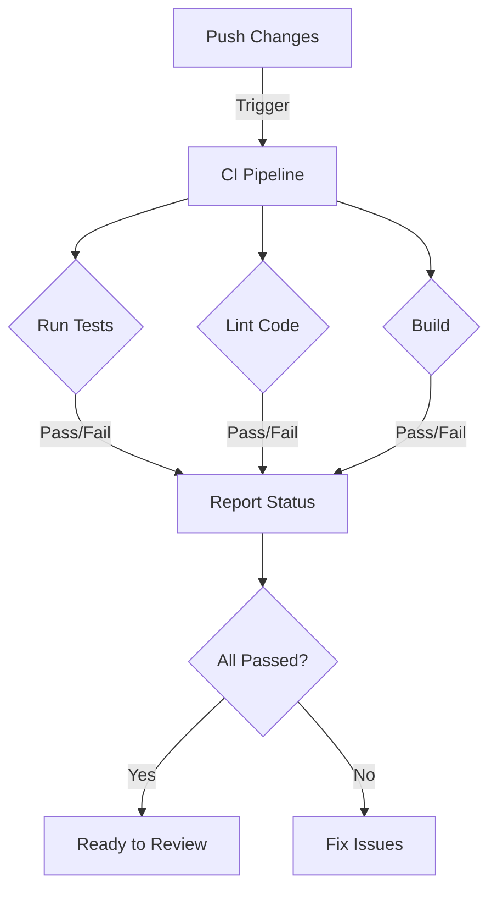

# Development Workflow Guidelines

## Table of Contents
- [GitHub Flow Overview](#github-flow-overview)
- [Branch Naming Convention](#branch-naming-convention)
- [Workflow Steps](#workflow-steps)
- [Pull Request Guidelines](#pull-request-guidelines)
- [Code Review Process](#code-review-process)
- [Merge Requirements](#merge-requirements)

## GitHub Flow Overview



## Branch Naming Convention

Branches should follow this naming pattern:
```
<type>/<description>
```

Where `type` is one of:
- `feature`: New features
- `fix`: Bug fixes
- `docs`: Documentation changes
- `refactor`: Code refactoring
- `test`: Adding or modifying tests
- `chore`: Maintenance tasks

Example: `feature/user-authentication` or `fix/login-timeout`

## Workflow Steps

### 1. Creating a Branch


- Always branch from the latest `main`
- Use meaningful branch names
- Keep branches focused on single features/fixes

### 2. Making Changes
- Make regular, small commits
- Write clear commit messages:
```
<type>: <description>

[optional body]
[optional footer]
```

Example:
```
feat: add user authentication system

- Implement JWT token generation
- Add password hashing
- Create login endpoints

Resolves: #123
```

## Pull Request Guidelines

### PR Template
```markdown
## Description
[Provide a brief description of the changes]

## Type of Change
- [ ] Bug fix
- [ ] New feature
- [ ] Breaking change
- [ ] Documentation update

## How Has This Been Tested?
[Describe the tests you ran]

## Checklist
- [ ] My code follows the project's style guidelines
- [ ] I have performed a self-review
- [ ] I have commented my code, particularly in hard-to-understand areas
- [ ] I have updated the documentation
- [ ] My changes generate no new warnings
- [ ] I have added tests that prove my fix/feature works
```

### PR Size Guidelines
- Aim for PRs under 400 lines of code changes
- Break large changes into smaller, logical PRs
- Each PR should represent one logical change

## Code Review Process



### Review Requirements
1. At least one approving review required
2. All comments must be resolved
3. CI checks must pass
4. No merge conflicts

### Reviewer Guidelines
- Review within 24 business hours
- Be constructive and specific
- Consider:
  - Code quality
  - Test coverage
  - Documentation
  - Security implications
  - Performance impact

## Merge Requirements

### Before Merging:
- [ ] All required reviews approved
- [ ] CI/CD pipeline passed
- [ ] Documentation updated
- [ ] Tests added/updated
- [ ] No merge conflicts
- [ ] Branch up to date with main

### Merge Strategy
- Use "Squash and merge" for feature branches
- Use clear, descriptive merge commit messages
- Delete branch after merging

## Continuous Integration



## Release Process
1. Ensure all tests pass on `main`
2. Create a release branch: `release/X.Y.Z`
3. Create a release tag
4. Deploy to staging
5. Verify in staging
6. Deploy to production

---